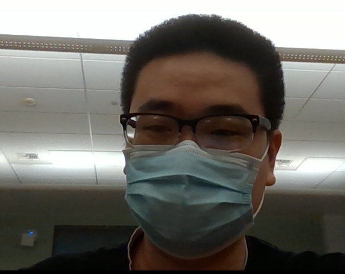

## Zhipeng Han

*Just call me Han*  
<p>&nbsp;</p>

[To Tasks](#tasks)
<p>&nbsp;</p>
My major is Computer Engineer.
<p>&nbsp;</p>
Frank Zappa said:

> So many books, so little time.

```
cout << "Hellow World" << endl;
```
I'm learning to use [VS Code](https://code.visualstudio.com/).

<p>&nbsp;</p>

[Relitive link to another MD file](other.md)

<p>&nbsp;</p>

## Hobby
1. Gaming
2. Eating
3. Hiking

<p>&nbsp;</p>

## Class Taking
- CSE 110
- CSE 101
- CSE 142/142L
- ECE 109

<p>&nbsp;</p>

## Tasks
- [x] Eat healthy
- [ ] Lost weight

[To top](#zhipeng-han)